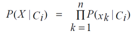

### Pertemuan 12 Teknologi Data 

### Dhuta Pamungkas I TI-3D

### Topic Naïve Bayes Classifier

Naïve Bayesian Classifier

Naive Bayes adalah keluarga algoritme probabilistik yang memanfaatkan teori probabilitas dan 
Teorema Bayes untuk memprediksi tag teks (seperti berita atau ulasan pelanggan). Mereka bersifat 
probabilistik, yang berarti bahwa mereka menghitung probabilitas setiap tag untuk teks tertentu, dan 
kemudian mengeluarkan tag dengan yang tertinggi. Cara mereka mendapatkan probabilitas ini adalah 
dengan menggunakan Teorema Bayes, yang mendeskripsikan probabilitas fitur, berdasarkan pengetahuan 
sebelumnya tentang kondisi yang mungkin terkait dengan fitur tersebut.

Dengan kata lain, Naïve Bayesian Classifier mengasumsikan bahwa keberadaan sebuah atribut 
(variabel) tidak ada kaitannya dengan beradaan atribut (variabel) yang lain.

- Karena asumsi atribut tidak saling terkait(conditionally independent), maka:

- Bila P(X|Ci) dapat diketahui melalui perhitungan di atas, maka klas (label) dari data sampel X 
adalah klas (label) yang memiliki P(X|Ci)*P(Ci) maksimum