### Pertemuan 4 Teknologi Data 

### Dhuta Pamungkas I TI-3D

### Topic Penjumlahan, Perkalian, Pengurangan, dan Perkalian

1. Program dengan python yang menerima input dari user berupa bilangan 1 dan bilangan 2. 

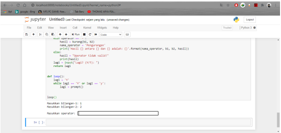

2. Setelah menginputkan kedua bilangan tersebut, maka user harus memasukkan input berupa 
operator penjumlahan (+), pengurangan (-), perkalian (*), atau pembagian (/). 

Tambah (+)

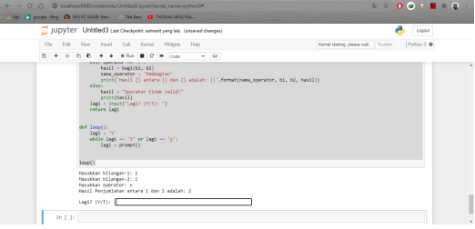

Kurang (-)

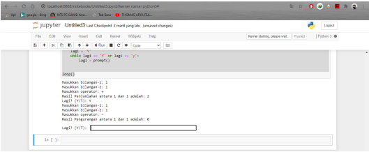

Kali (*)

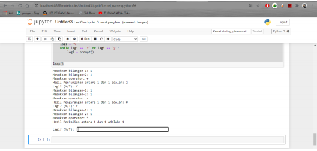

Bagi (/)

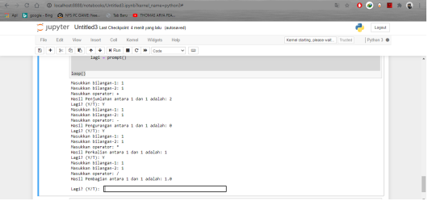

3. Ketika operator yang dimasukkan benar, maka akan ditampilkan tulisan: 

 “Hasil xxx antara yyy dan zzz adalah: kkk”. Dimana:

- xxx à Nama operator 
- yyy à Bilangan-1 
- zzz à Bilangan-2 
- Kkk à Hasil perhitungan sesuai operator 

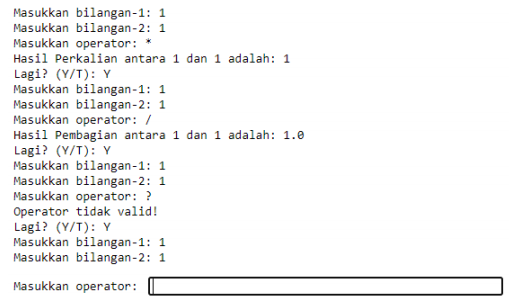

4. Jika operator dimasukkan selain operator tersebut di atas, dimunculkan tulisan: 

“Operator tidak valid”

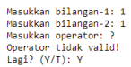

5.  Setelah memunculkan tulisan hasil atau pesan error, dimunculkan tulisan: 

“Lagi? (Y/T)” 

Y

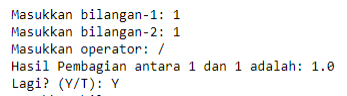

T

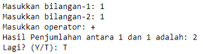

 Jika user memasukkan Y maka akan ditampilkan mulai dari awal lagi. Jika selain Y maka 
programnya berhenti.

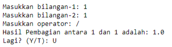

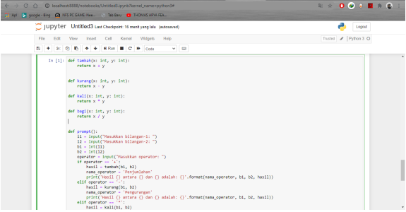

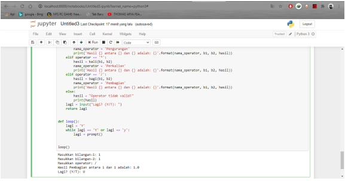
