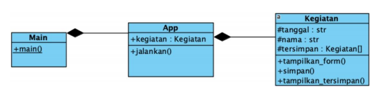

### Pertemuan 6 Teknologi Data 

### Dhuta Pamungkas I TI-3D

### Topic Pemrograman Python Tingkat Lanjut

Studi kasus #1 (OOP)

Buatlah sebuah aplikasi konsol yang mampu menyimpan catatan tentang kegiatan dari 
penggunanya. Setiap data kegiatan yang disimpan memiliki tanggal dan nama kegiatannya. 
Program dapat menerima input dari user dan juga menampilkan data yang tersimpan tergantung 
pada menu yang mana yang dipilih oleh user tersebut.

Studi kasus #2 (OOP + Pandas)

• Pada program konsol yang sebelumya,
tambahkan 1 lagi menu yaitu (3) Latihan Pandas. Apabila menu tersebut dipilih maka akan 
memunculkan hasil dari
semua method pada slide ini yang membahas Pandas:

• load_dataset()

• tampilkan_5_baris_awal_akhir()

• tampilkan_data_sistem_cerdas()

• tampilkan_pengusul_dan_judul()

• Anda cukup mengetik ulang kode pada
method-method tersebut seperti yang terlihat pada slide ini.

• Kerjakan dengan menggunakan
paradigma OOP dengan tanpa mengubah- ubah script class Kegiatan yang sudah ada 
sebelumnya!
