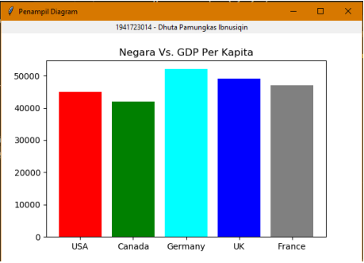
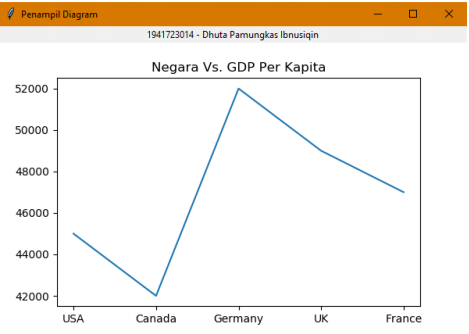
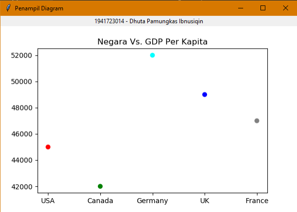

### Pertemuan 7 Teknologi Data 

### Dhuta Pamungkas I TI-3D

### Topic GUI dan PLOT

Kalkulator GUI

• Pada source code sample yang diberikan, sudah ada script untuk membuat 
program kalkulator dengan GUI Tkinter, namun hanya ada fitur Tambah 
(+)saja.

• Uncomment source code yang diperlukan, sehingga program Kalkulator GUI dapat
dijalankan

• Tambahkan fitur kurang (-), kali (x), dan bagi (/) pada program kalkulator GUI

• Tambahkan label yang berisi Nama Anda ke program 

SRC Hello GUI 

 -main.py

```
from window.hellogui import HelloGUI
class Main:
 @staticmethod
 def main():
 #main_window = KalkulatorGUI()
 #main_window = PenampilDiagram()
 main_window = HelloGUI()
 main_window.show()
Main.main()
```

 -hellogui.py

[Hellogui](../src/window/hellogui.py)

 -main.py

```
from window.kalkulatorgui import KalkulatorGUI
# from window.penampildiagram import PenampilDiagram
# from window.hellogui import HelloGUI
class Main:
 @staticmethod
 def main():
 main_window = KalkulatorGUI()
 #main_window = PenampilDiagram()
 # main_window = HelloGUI()
 main_window.show()Main.main()

```

 -kalkulator.py

[Hellogui](../src/window/kalkulator.py)

Matplotlib GUI

• Buat sebuah program yang menampilkan ketiga jenis Plot yang dicontohkan pada 
slideini.

• Tambahkan juga label yang berisi namaAnda ke Program.

 -main.py

 ```
from window.kalkulatorgui import KalkulatorGUI
from window.penampildiagram import PenampilDiagram
# from window.hellogui import HelloGUI
class Main:
 @staticmethod
 def main():
 # main_window = KalkulatorGUI()
 main_window = PenampilDiagram()
 # main_window = HelloGUI()
 main_window.show()
Main.main()
 ```

 -Penampildiagram.py

[Hellogui](../src/window/penampildiagram.py)

Tampilan Diagram GUI

1. Bar Plot



2. Line Plot



3. Scetter Plot


